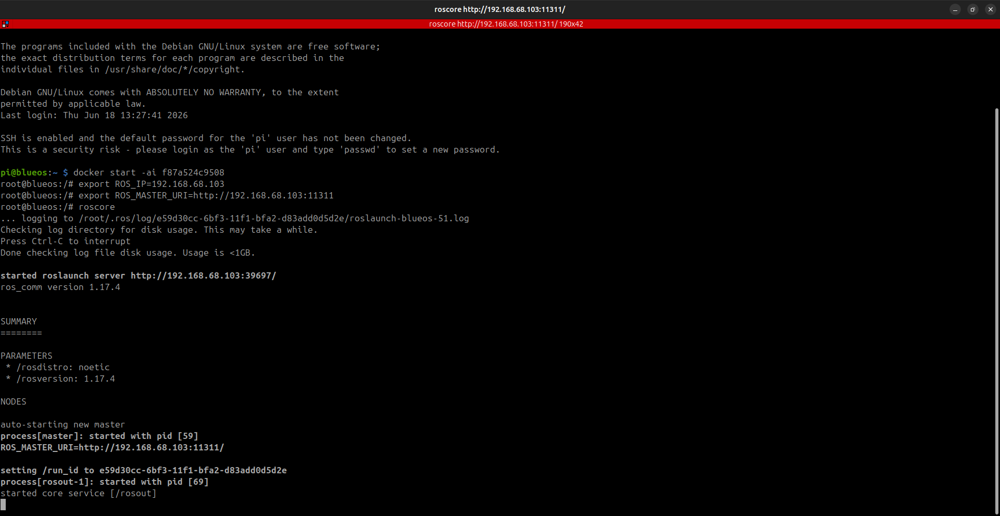
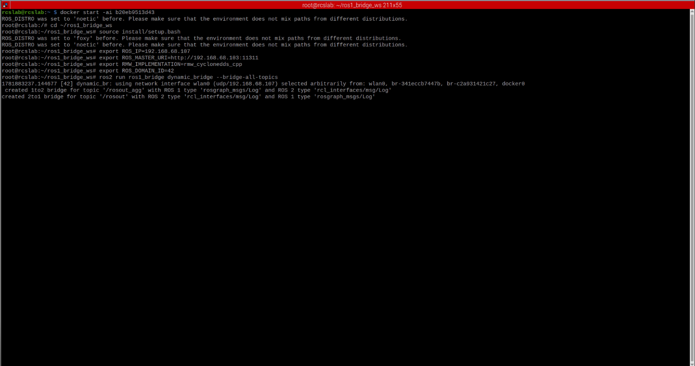
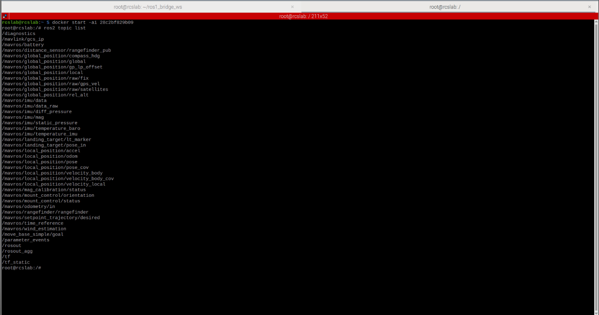
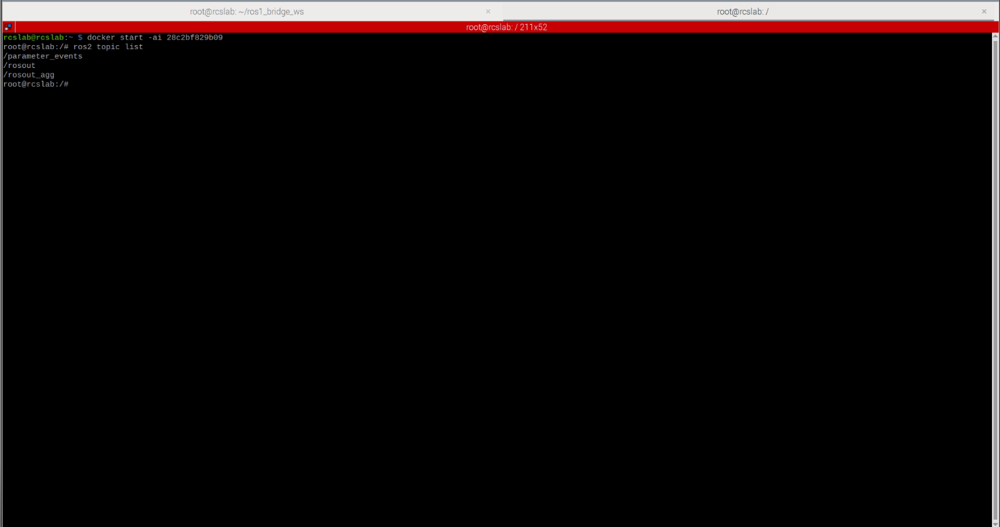

# Examples

This page demonstrates a complete ROS 1 to ROS 2 bridge deployment using the provided Docker containers and networking configuration.

The example environment consists of:

| Component                     | Address        |
| ----------------------------- | -------------- |
| Raspberry Pi 4 (ROS 1 Master) | <ros1_container_IP> |
| Bridge Host                   | <ros_bridge_container_IP> |
| Middleware                    | CycloneDDS     |
| ROS Versions                  | Noetic ↔ Foxy  |

---

# 1 - Start the ROS 1 Master

Start the ROS 1 container on the Raspberry Pi:

```bash
docker start -ai <ros1_container_id>
```

Configure ROS networking:

```bash
export ROS_IP=<ros1_container_IP>
export ROS_MASTER_URI=http://<ros1_container_IP>:11311
```

Start the ROS master:

```bash
roscore
```

Expected output:

```text
started roslaunch server
ROS_MASTER_URI=http://<ros1_container_IP>:11311/
process[master]: started
process[rosout-1]: started
```

The ROS master is now running and accepting ROS 1 node registrations.

## Screenshot



The screenshot shows a ROS Noetic master successfully running on the Raspberry Pi 4.

---

# 2 - Start the ROS 1 to ROS 2 Bridge

Start the bridge container:

```bash
docker start -ai <ros_bridge_container_id>
```

Configure the runtime environment:

```bash
source /ros1_bridge_ws/install/setup.bash

export ROS_IP=<ros2_container_IP>
export ROS_MASTER_URI=http://<ros1_container_IP>:11311
export RMW_IMPLEMENTATION=rmw_cyclonedds_cpp
```

Launch the dynamic bridge:

```bash
ros2 run ros1_bridge dynamic_bridge
```

Expected output:

```text
created 1to2 bridge for topic '/rosout_agg'
created 2to1 bridge for topic '/rosout'
```

The bridge automatically discovers compatible message types and creates forwarding routes.

## Screenshot



The bridge is actively connected to the ROS 1 master and has established topic translation routes.

---

# 3 - Verify ROS 2 Topic Discovery

Open a new terminal on the bridge host and inspect ROS 2 topics:

```bash
ros2 topic list
```

Example output:

```text
/parameter_events
/rosout
/rosout_agg
```

The bridged ROS 1 topics should now appear inside the ROS 2 environment.

## Screenshot



The screenshot demonstrates successful DDS discovery and ROS 2 topic visibility through the bridge.

---

# 4 - Verify ROS 2 Runtime

Inspect the ROS 2 environment:

```bash
ros2 node list
```

Inspect topic information:

```bash
ros2 topic info /rosout_agg
```

Inspect active publishers:

```bash
ros2 topic echo /rosout_agg
```

## Screenshot



This terminal shows the ROS 2 environment successfully interacting with topics exposed through the bridge.

---

# 5 - End-to-End Message Verification

Publish a ROS 1 message:

```bash
rostopic pub /test_topic std_msgs/String "data: 'hello from ros1'"
```

From ROS 2:

```bash
ros2 topic echo /test_topic
```

Expected output:

```text
data: hello from ros1
```

Publish from ROS 2:

```bash
ros2 topic pub /test_topic std_msgs/msg/String "{data: 'hello from ros2'}"
```

From ROS 1:

```bash
rostopic echo /test_topic
```

Expected output:

```text
data: hello from ros2
```

Successful message exchange confirms bidirectional communication between ROS 1 and ROS 2.

---

# Validation Checklist

After completing the examples:

* [ ] ROS Master is running
* [ ] ROS Master is reachable from the bridge host
* [ ] Dynamic bridge started successfully
* [ ] ROS 2 topics are visible
* [ ] DDS discovery is operational
* [ ] Topic routes were created automatically
* [ ] ROS 1 → ROS 2 communication works
* [ ] ROS 2 → ROS 1 communication works

When all checklist items are satisfied, the bridge deployment is operating correctly.
